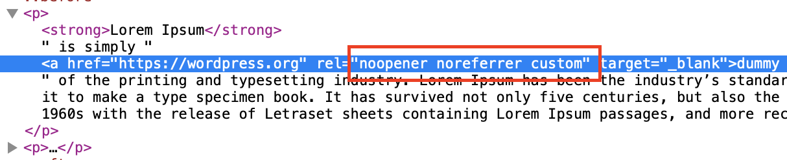

# WordPress Plugin to Remove rel="noreferrer" from Post's links on the frontend

## Screenshots

| Before installation |
| --- |
|  |

| After installation |
| --- |
|  |

## Contributing

Check [CONTRIBUTING.md](https://github.com/gruz0/remove-noreferrer/blob/master/CONTRIBUTING.md) file for more details.

## Copyright

Released under [GPLv2 or later](https://www.gnu.org/licenses/gpl-2.0.html)

Copyright &copy; 2019 Alexander Kadyrov.
